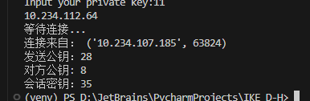
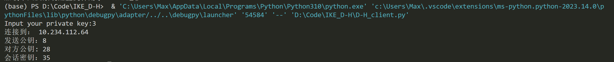

# IKE_D-H

## 0. 概述

本仓库为信息安全导论课程作业：验证D-H密钥交换机制。使用100-255之间的素数(和原根)构建单向函数，按照D-H协议机制流程进行计算，通过socket套接字在主机间交换公钥，实现密钥交换。

## 1. 验证素数及原根


## 2. 按照D-H协议机制流程进行计算

代码详见：[服务端](D-H_server.py)    [客户端](D-H_client.py)

### 2.1 选择素数及原根

选用素数 $p=2$ 及其原根 $g=101$ 

### 2.2 构建单向函数f

```python
def f(g, x, p):
    return pow(g, x) % p
```

### 2.3 选择私密整数并计算公开的数

```python
privateKey = input("输入你的私钥：")
privateKey = int(privateKey)
publicKey = f(g, privateKey, p)
```

### 2.4 相互交换公开的数

#### 服务端：

```python
# 启动服务端
server_socket = socket(AF_INET, SOCK_STREAM)
host = gethostbyname(gethostname())
print(host)
server_socket.bind((host, 12345))
server_socket.listen(1)
print('等待连接...')
conn, addr = server_socket.accept()
print('连接来自：', addr)

# 发送公钥给客户端
print(f"发送公钥：{publicKey}")
conn.send(str(publicKey).encode())

# 接收客户端消息并打印
counter_publicKey = conn.recv(1024)
print(f"对方公钥: {int(counter_publicKey.decode())}")
```

#### 客户端：

```python
privateKey = input("输入你的私钥：")
privateKey = int(privateKey)# 连接到服务端
host = 'localhost'
conn = socket(AF_INET, SOCK_STREAM)
conn.connect((host, 12345))
print('连接到：', host)

# 发送公钥给服务端
print(f"发送公钥：{publicKey}")
conn.send(str(publicKey).encode())

# 接收服务端消息并打印
counter_publicKey = conn.recv(1024)
print(f"对方公钥: {counter_publicKey.decode()}")
```

### 2.5 各自计算会话密钥

```python
Ks = f(int(counter_publicKey), privateKey, p)
print(f"会话密钥：{Ks}")
```


## 3. 测试结果

### 服务端：



### 客户端：



由图可见，通过迪菲-赫尔曼密钥交换机制，通信双方可以在不直接传递密钥的情况下协商一个共享的密钥。
